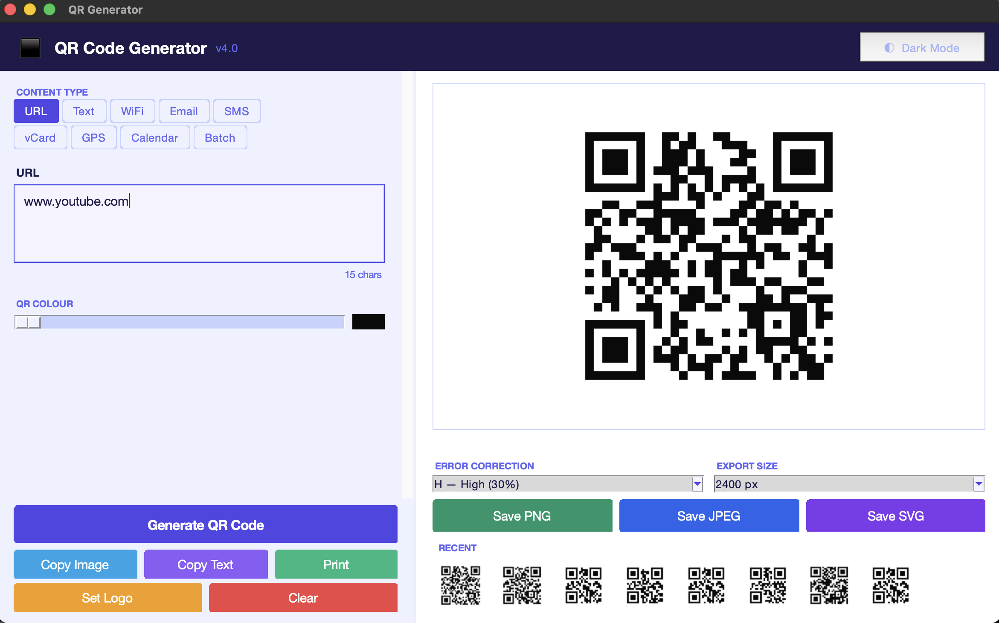
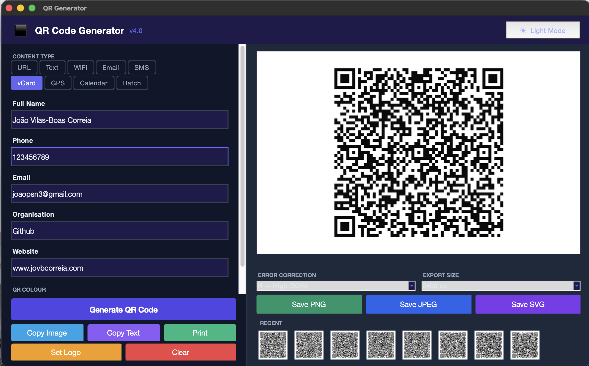
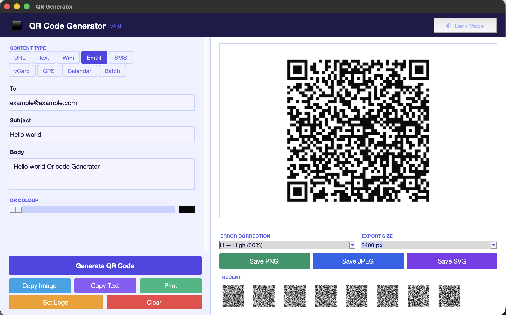

# QR Code Generator

> A modern desktop application to generate QR codes instantly — built entirely with Python.

**Author:** João Vilas-Boas Correia — [joaopsn3@gmail.com](mailto:joaopsn3@gmail.com)  
**License:** MIT  
**Version:** 4.0.0  
**Platform:** macOS · Windows · Linux (desktop)

---

## Screenshots

### Light Mode — URL


### Dark Mode — vCard


### Light Mode — Email


---

## What is this?

**QR Code Generator** is a standalone desktop app that lets you create, preview, and export QR codes for any type of content — no browser, no internet connection, no account required.

It runs locally on your machine and opens as a native window. You type or fill in a form, the QR code updates live on screen, and you save it in the format you need.

---

## Features

### 9 Content Types

Each type has a dedicated smart form that builds the correct QR payload automatically:

| Type | What it generates | Use case |
|---|---|---|
| **URL** | Raw URL string | Link to any website |
| **Text** | Plain text | Notes, coupons, codes |
| **WiFi** | `WIFI:T:WPA;S:…;P:…;;` | Share Wi-Fi credentials — phone scans and connects automatically |
| **Email** | `mailto:…?subject=…&body=…` | Pre-filled email compose |
| **SMS** | `smsto:number:message` | Pre-filled SMS to a number |
| **vCard** | `MECARD:N:…;TEL:…;EMAIL:…;` | Digital business card — scan to save contact |
| **GPS** | `geo:lat,lon?q=…` | Share a location — opens in Maps on any phone |
| **Calendar** | `BEGIN:VEVENT … END:VEVENT` | Add an event to the phone calendar |
| **Batch** | One QR per line | Export dozens of QR codes at once as a ZIP file |

### Live Preview
The QR code renders automatically as you type (300 ms debounce). No need to click Generate — it just appears.

### History Strip
The last 8 generated QR codes are shown as thumbnails at the bottom of the preview panel. Click any thumbnail to reload it instantly.

### Auto-detect
When you type in the URL field, the app detects if the content looks like an email address or phone number and suggests switching to the right tab.

### QR Colour Slider
A greyscale slider lets you change the foreground colour of the QR code — from pure black to dark grey — for branding or aesthetic purposes.

### Logo Overlay
Upload a PNG or JPEG logo to embed in the centre of the QR code. The app automatically forces **Error Correction H** (30% recovery) to keep the code scannable even with the logo covering part of it.

### Error Correction
Choose between four ISO levels:

| Level | Recovery capacity | Best for |
|---|---|---|
| L | ~7% | Clean environments, digital screens |
| M | ~15% | General use (default) |
| Q | ~25% | Printed materials |
| H | ~30% | Logos, stickers, outdoor use |

### Export Options

| Action | Description |
|---|---|
| **Save PNG** | Lossless, configurable size |
| **Save JPEG** | Compressed, quality 95, configurable size |
| **Save SVG** | Vector format — scales infinitely with no pixelation |
| **Copy Image** | Copies the QR code directly to the clipboard (macOS) |
| **Copy Text** | Copies the raw encoded string to the clipboard |
| **Print** | Sends to the system default printer |

### Export Size
Choose the pixel size of the exported file: **400 px**, **800 px**, **1200 px**, or **2400 px**.

### Batch Export
Switch to the **Batch** tab, paste one URL (or any content) per line, and click **Export all as ZIP**. The app generates one QR code per line and packages them all in a single ZIP file — named `qr_001.png`, `qr_002.png`, etc.

### Dark Mode
Toggle between a light indigo theme and a dark navy theme with a single click. Form data and the current QR code are preserved across the switch.

---

## Tech Stack

| Library | Purpose |
|---|---|
| **Python 3.10+** | Language |
| **tkinter** | Native GUI (built-in, no install needed) |
| **qrcode** | QR matrix generation + SVG export |
| **Pillow** | Image manipulation, export, logo overlay |

No Electron. No web view. No framework overhead — just Python running natively on your desktop.

---

## Getting Started

### 1. Clone

```bash
git clone https://github.com/jovbcorreia/qrcode-generator.git
cd qrcode-generator
```

### 2. Install dependencies

```bash
pip install -r requirements.txt
```

> **macOS note:** If you get a `_tkinter` error, run `brew install python-tk@3.13` first.

### 3. Run

```bash
python3 app.py
```

The window opens centred on your screen. It is resizable — drag any edge to make it bigger.

---

## Project Structure

```
qrcode-generator/
├── app.py            # Entire application — single file, ~600 lines
├── requirements.txt  # Python dependencies (qrcode + Pillow)
├── pyproject.toml    # Package metadata
├── LICENSE           # MIT licence
├── README.md         # This file
└── screenshots/      # App screenshots
    ├── light-url.png
    ├── dark-vcard.png
    └── light-email.png
```

---

## Keyboard & UI Tips

- **Type in the form** → QR updates automatically (no need to click Generate)
- **Click Generate** → forces a re-render (useful after changing Error Correction)
- **Click a history thumbnail** → reloads that QR code and content
- **Set Logo + Clear** → Clear also removes the logo

---

## License

```
MIT License

Copyright (c) 2026 João Vilas-Boas Correia <joaopsn3@gmail.com>

Permission is hereby granted, free of charge, to any person obtaining a copy
of this software and associated documentation files (the "Software"), to deal
in the Software without restriction, including without limitation the rights
to use, copy, modify, merge, publish, distribute, sublicense, and/or sell
copies of the Software, and to permit persons to whom the Software is
furnished to do so, subject to the following conditions:

The above copyright notice and this permission notice shall be included in all
copies or substantial portions of the Software.

THE SOFTWARE IS PROVIDED "AS IS", WITHOUT WARRANTY OF ANY KIND, EXPRESS OR
IMPLIED, INCLUDING BUT NOT LIMITED TO THE WARRANTIES OF MERCHANTABILITY,
FITNESS FOR A PARTICULAR PURPOSE AND NONINFRINGEMENT. IN NO EVENT SHALL THE
AUTHORS OR COPYRIGHT HOLDERS BE LIABLE FOR ANY CLAIM, DAMAGES OR OTHER
LIABILITY, WHETHER IN AN ACTION OF CONTRACT, TORT OR OTHERWISE, ARISING FROM,
OUT OF OR IN CONNECTION WITH THE SOFTWARE OR THE USE OR OTHER DEALINGS IN
THE SOFTWARE.
```
